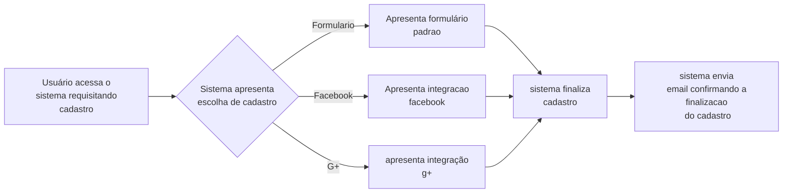
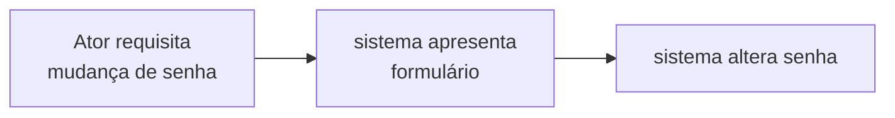
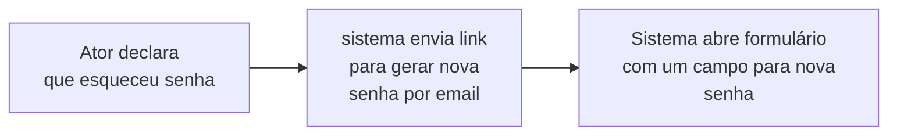

# Usuário

Usuário é uma entidade que carrega informações básicas sobre todos os atores envolvidos no sistema.

## Atributos
Os atributos que um usuário possui são:
|Atributo|Tipo  |
|--|--|
|Nome  |String  |
|Email	|String	|
|Data de nascimento	|LocalDate	|
|Senha	|String criptografada keycloack	|

## Rede social
Os usuários poderão vincular suas contas de gmail e facebook para facilitar o acesso a informação.

## Cadastro
O cadastro pede essa informações básicas e pode ser feito  vinculando sua conta de redes sociais.

## Alterar senha

O sistema permite alterar senha, o formulário deve conter a nova antiga e duas confirmações da senha nova.

## Esqueci senha
O sistema envia uma senha provisória para o usuário.

## Dados para contato
Fica disponibilizado ao usuário um menu para indicar formas de contato.
O usuário pode informar até 3 telefones de contato, cada um de um tipo: celular, casa, trabalho
### Telefone
|Atributo| tipo|
|--|--|
|Numero| String [(__) 9____-____]|
|Tipo| CELULAR, CASA, TRABALHO|

### Dados de contato durante a comeerj
Durante o evento pode haver a necessidade de se comunicar com algum conhecido, deve se apresentar pelo ao menos uma opção de contato, apresentando telefone e nome.

## Responsável
Se o usuário for menor de idade ele deve dar informações acerca do seu responsável
### Dados do responsável
|Atributo|Tipo|
|--|--|
|Nome|Texto|
|Identidade|Texto|

## Alimentação
O sistema deve disponibilizar uma área para informar seu tipo de alimentação:

 1. Normal
 2. Vegetariana
 3. Vegana
 4. Com restrição
Caso haja restrição abrir um campo para informar qual.

## Dados médicos
O sistema disponibilizar um campo para informar dados médicos.
### Plano de saúde
Informar se o usuário possui o plano de saúde e qual
### Medicação rotineira
Informar se o usuário faz uso contínuo de medicamentos e quais medicamentos
### Alergias
Informar alergias que o usuário possui, seria bom o sistema disponibilizar uma lista que o usuário pudesse encontrar sua alergia.
## Dados da instituição espírita
Aqui se concentram informações básicas da instituição espírita que o usuário frequenta.
|Atributo|Tipo|
|--|--|
|nome| texto|
|DiaReuniao|DOM,SEG,TER,QUA,QUI,SEX,SAB|
|HoraReuniaoMocidade|Hora:Minuto|
|Atividades|Lista de atividades com outros|
|CEU|Numero|

> Written with [StackEdit](https://stackedit.io/).
